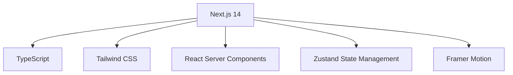
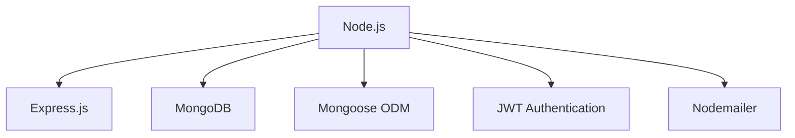
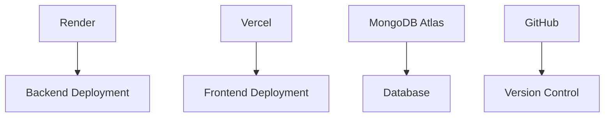
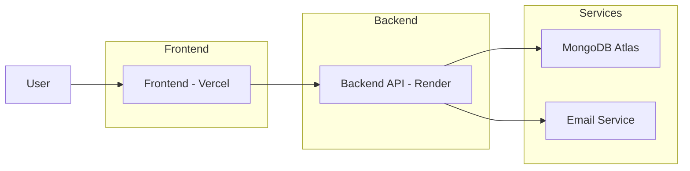

# 🎵 Music Instruments Store

<p align="center">
  A modern, full-featured e-commerce platform for musical instruments with advanced interactive features
</p>

<p align="center">
  <a href="#features">Features</a> •
  <a href="#tech-stack">Tech Stack</a> •
  <a href="#architecture">Architecture</a> •
  <a href="#getting-started">Getting Started</a> •
  <a href="#deployment">Deployment</a>
</p>

---

## 🌟 Overview

A modern, full-featured e-commerce platform for musical instruments with advanced interactive features. This application combines the power of cutting-edge web technologies to deliver an exceptional shopping experience for music enthusiasts.

### 🎯 Key Objectives
- Create an immersive shopping experience for musical instruments
- Provide interactive tools for customers to explore sounds
- Enable seamless purchasing with secure payment processing
- Offer admin capabilities for inventory and order management

---

## 🚀 Features

### 🛍️ E-Commerce Functionality
- **User Authentication**: Secure registration and login system
- **Product Catalog**: Comprehensive instrument listings with categories
- **Shopping Cart**: Intuitive cart management
- **Order Processing**: Complete checkout and order tracking
- **Wishlist**: Save favorite items for later
- **Search & Filter**: Advanced product discovery tools

### 🎵 Interactive Music Experience
- **Sound Customizer**: Try before you buy with interactive sound samples
- **Instrument Showcase**: Visual exploration of featured instruments
- **Music Visualizer**: Real-time audio visualization
- **Rhythm Builder**: Create and share musical patterns
- **Musical Quiz**: Test your music knowledge

### 👨‍💼 Admin Dashboard
- **Product Management**: Add, edit, and remove products
- **Order Management**: Track and fulfill customer orders
- **User Management**: Monitor customer accounts
- **Inventory Control**: Stock level monitoring and alerts
- **Analytics**: Sales and user behavior insights

### 📱 Modern UI/UX
- **Responsive Design**: Works on all device sizes
- **Smooth Animations**: Engaging visual effects
- **Dark/Light Mode**: User preference support
- **Accessibility**: WCAG compliant interface

---

## 🛠 Tech Stack

### Frontend


### Backend


### DevOps


---

## 🏗 Architecture



### System Components
1. **Frontend Application**: Next.js application deployed on Vercel
2. **Backend API**: Express.js REST API deployed on Render
3. **Database**: MongoDB database hosted on MongoDB Atlas
4. **Email Service**: Nodemailer integration for notifications
5. **Static Assets**: Images hosted on various CDNs

---

## 🚀 Getting Started

### Prerequisites
- Node.js (v14 or higher)
- MongoDB database
- npm or yarn package manager

### Installation

1. **Clone the repository:**
   ```bash
   git clone <repository-url>
   cd music-instruments-store
   ```

2. **Backend Setup:**
   ```bash
   cd backend
   npm install
   cp .env.example .env
   # Configure your environment variables
   npm run dev
   ```

3. **Frontend Setup:**
   ```bash
   cd frontend
   npm install
   cp .env.local.example .env.local
   # Configure your environment variables
   npm run dev
   ```

4. **Access the application:**
   - Frontend: http://localhost:3000
   - Backend API: http://localhost:5000

---

## ☁️ Deployment

### Backend (Render)
1. Push code to GitHub
2. Create new Web Service on Render
3. Connect repository
4. Configure environment variables
5. Deploy

### Frontend (Vercel)
1. Push code to GitHub
2. Create new Project on Vercel
3. Import repository
4. Configure environment variables
5. Deploy

---

## 📈 Future Enhancements

### 🎯 Planned Features
- **AI-Powered Recommendations**: Personalized product suggestions
- **Augmented Reality**: Virtual instrument try-on experience
- **Community Features**: User reviews, forums, and social sharing
- **Mobile App**: Native iOS and Android applications
- **Advanced Analytics**: Heatmaps and user behavior tracking
- **Subscription Service**: Regular instrument rental program
- **Live Support**: Real-time chat with music experts

### 🛠 Technical Improvements
- **Microservices Architecture**: Separate services for different functionalities
- **GraphQL API**: More flexible data querying
- **Real-time Notifications**: WebSocket integration for updates
- **Performance Optimization**: Image optimization and caching strategies
- **Internationalization**: Multi-language support

---

## 🤝 Contributing

1. Fork the repository
2. Create a feature branch
3. Commit your changes
4. Push to the branch
5. Open a pull request

---

## 📄 License

This project is licensed under the MIT License.

---

## 📞 Support

For support, email musichaven.store@gmail.com or open an issue in the repository.

---

<p align="center">
  <a href="YOUR_LIVE_LINK_HERE">
    
  </a>
</p>