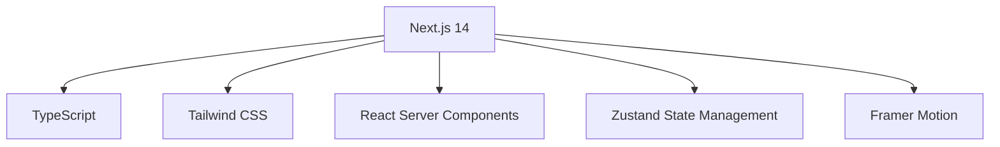
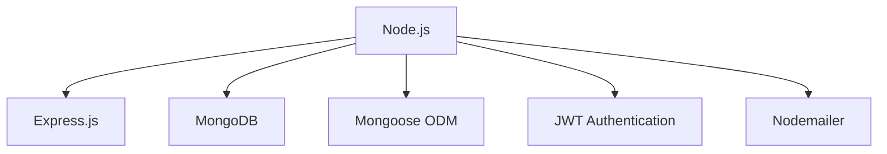
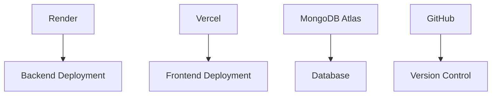
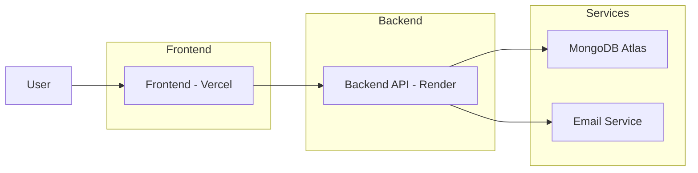

# 🎵 MelodicMart - Music Instruments Store

<p align="center">
  <a href="#overview">🌟 Overview</a> •
  <a href="#features">🚀 Features</a> •
  <a href="#tech-stack">🛠 Tech Stack</a> •
  <a href="#architecture">🏗 Architecture</a> •
  <a href="#getting-started">🚀 Getting Started</a> •
  <a href="#deployment">☁️ Deployment</a> •
  <a href="#future-enhancements">📈 Future Enhancements</a>
</p>

---

## <a name="overview"></a>🌟 Overview

<div style="background: linear-gradient(135deg, #667eea 0%, #764ba2 100%); padding: 20px; border-radius: 15px; box-shadow: 0 10px 20px rgba(0,0,0,0.1);">

<p align="center">
  <strong>A modern, full-featured e-commerce platform for musical instruments with advanced interactive features</strong>
</p>

<p align="center">
  <em>Experience the future of online music shopping with our immersive platform</em>
</p>

</div>

### 🎯 Key Objectives
- 🎵 Create an immersive shopping experience for musical instruments
- 🔊 Provide interactive tools for customers to explore sounds
- 💳 Enable seamless purchasing with secure payment processing
- 👨‍💼 Offer admin capabilities for inventory and order management

---

## <a name="features"></a>🚀 Features

### 🛍️ E-Commerce Functionality
<div style="background: linear-gradient(to right, #ff7e5f, #feb47b); padding: 15px; border-radius: 10px; margin-bottom: 15px;">
<ul>
  <li><strong>User Authentication</strong>: 🔐 Secure registration and login system</li>
  <li><strong>Product Catalog</strong>: 📁 Comprehensive instrument listings with categories</li>
  <li><strong>Shopping Cart</strong>: 🛒 Intuitive cart management</li>
  <li><strong>Order Processing</strong>: 📦 Complete checkout and order tracking</li>
  <li><strong>Wishlist</strong>: ❤️ Save favorite items for later</li>
  <li><strong>Search & Filter</strong>: 🔍 Advanced product discovery tools</li>
</ul>
</div>

### 🎵 Interactive Music Experience
<div style="background: linear-gradient(to right, #00c9ff, #92fe9d); padding: 15px; border-radius: 10px; margin-bottom: 15px;">
<ul>
  <li><strong>Sound Customizer</strong>: 🎧 Try before you buy with interactive sound samples</li>
  <li><strong>Instrument Showcase</strong>: 🎼 Visual exploration of featured instruments</li>
  <li><strong>Music Visualizer</strong>: 🌈 Real-time audio visualization</li>
  <li><strong>Rhythm Builder</strong>: 🥁 Create and share musical patterns</li>
  <li><strong>Musical Quiz</strong>: ❓ Test your music knowledge</li>
</ul>
</div>

### 👨‍💼 Admin Dashboard
<div style="background: linear-gradient(to right, #834d9b, #d04ed6); padding: 15px; border-radius: 10px; margin-bottom: 15px;">
<ul>
  <li><strong>Product Management</strong>: ➕ Add, edit, and remove products</li>
  <li><strong>Order Management</strong>: 📋 Track and fulfill customer orders</li>
  <li><strong>User Management</strong>: 👥 Monitor customer accounts</li>
  <li><strong>Inventory Control</strong>: 📉 Stock level monitoring and alerts</li>
  <li><strong>Analytics</strong>: 📊 Sales and user behavior insights</li>
</ul>
</div>

### 📱 Modern UI/UX
<div style="background: linear-gradient(to right, #4b6cb7, #182848); padding: 15px; border-radius: 10px;">
<ul>
  <li><strong>Responsive Design</strong>: 📱 Works on all device sizes</li>
  <li><strong>Smooth Animations</strong>: ✨ Engaging visual effects</li>
  <li><strong>Dark/Light Mode</strong>: 🌙 User preference support</li>
  <li><strong>Accessibility</strong>: ♿ WCAG compliant interface</li>
</ul>
</div>

---

## <a name="tech-stack"></a>🛠 Tech Stack

### Frontend
<div style="background: linear-gradient(45deg, #ff9a9e 0%, #fad0c4 100%); padding: 15px; border-radius: 10px; margin-bottom: 15px;">

</div>

### Backend
<div style="background: linear-gradient(45deg, #a1c4fd 0%, #c2e9fb 100%); padding: 15px; border-radius: 10px; margin-bottom: 15px;">

</div>

### DevOps
<div style="background: linear-gradient(45deg, #d4fc79 0%, #96e6a1 100%); padding: 15px; border-radius: 10px;">

</div>

---

## <a name="architecture"></a>🏗 Architecture

<div style="background: linear-gradient(45deg, #f093fb 0%, #f5576c 100%); padding: 20px; border-radius: 15px;">

</div>

### System Components
1. 🖥️ **Frontend Application**: Next.js application deployed on Vercel
2. ⚙️ **Backend API**: Express.js REST API deployed on Render
3. 🗄️ **Database**: MongoDB database hosted on MongoDB Atlas
4. 📧 **Email Service**: Nodemailer integration for notifications
5. ☁️ **Static Assets**: Images hosted on various CDNs

---

## <a name="getting-started"></a>🚀 Getting Started

### Prerequisites
- 🟢 Node.js (v14 or higher)
- 🗃️ MongoDB database
- 📦 npm or yarn package manager

### Installation

1. **Clone the repository:**
   ```bash
   git clone <repository-url>
   cd music-instruments-store
   ```

2. **Backend Setup:**
   ```bash
   cd backend
   npm install
   cp .env.example .env
   # Configure your environment variables
   npm run dev
   ```

3. **Frontend Setup:**
   ```bash
   cd frontend
   npm install
   cp .env.local.example .env.local
   # Configure your environment variables
   npm run dev
   ```

4. **Access the application:**
   - Frontend: http://localhost:3000
   - Backend API: http://localhost:5000

---

## <a name="deployment"></a>☁️ Deployment

### Backend (Render)
<div style="background: linear-gradient(to right, #8E2DE2, #4A00E0); color: white; padding: 15px; border-radius: 10px; margin-bottom: 15px;">
<ol>
  <li>📥 Push code to GitHub</li>
  <li>➕ Create new Web Service on Render</li>
  <li>🔗 Connect repository</li>
  <li>⚙️ Configure environment variables</li>
  <li>🚀 Deploy</li>
</ol>
</div>

### Frontend (Vercel)
<div style="background: linear-gradient(to right, #00b09b, #96c93d); color: white; padding: 15px; border-radius: 10px;">
<ol>
  <li>📥 Push code to GitHub</li>
  <li>➕ Create new Project on Vercel</li>
  <li>🔗 Import repository</li>
  <li>⚙️ Configure environment variables</li>
  <li>🚀 Deploy</li>
</ol>
</div>

---

## <a name="future-enhancements"></a>📈 Future Enhancements

### 🎯 Planned Features
<div style="background: linear-gradient(to right, #FF512F, #F09819); padding: 15px; border-radius: 10px; margin-bottom: 15px;">
<ul>
  <li>🤖 <strong>AI-Powered Recommendations</strong>: Personalized product suggestions</li>
  <li>👓 <strong>Augmented Reality</strong>: Virtual instrument try-on experience</li>
  <li>👥 <strong>Community Features</strong>: User reviews, forums, and social sharing</li>
  <li>📱 <strong>Mobile App</strong>: Native iOS and Android applications</li>
  <li>📊 <strong>Advanced Analytics</strong>: Heatmaps and user behavior tracking</li>
  <li>🔄 <strong>Subscription Service</strong>: Regular instrument rental program</li>
  <li>💬 <strong>Live Support</strong>: Real-time chat with music experts</li>
</ul>
</div>

### 🛠 Technical Improvements
<div style="background: linear-gradient(to right, #3A1C71, #D76D77, #FFAF7B); padding: 15px; border-radius: 10px;">
<ul>
  <li>🧩 <strong>Microservices Architecture</strong>: Separate services for different functionalities</li>
  <li>📡 <strong>GraphQL API</strong>: More flexible data querying</li>
  <li>⚡ <strong>Real-time Notifications</strong>: WebSocket integration for updates</li>
  <li>🚀 <strong>Performance Optimization</strong>: Image optimization and caching strategies</li>
  <li>🌐 <strong>Internationalization</strong>: Multi-language support</li>
</ul>
</div>

---

## 🤝 Contributing

<div style="background: linear-gradient(to right, #11998e, #38ef7d); padding: 15px; border-radius: 10px; text-align: center;">
<ol style="display: inline-block; text-align: left;">
  <li>🍴 Fork the repository</li>
  <li>🌿 Create a feature branch</li>
  <li>💾 Commit your changes</li>
  <li>📤 Push to the branch</li>
  <li>🔄 Open a pull request</li>
</ol>
</div>

---

## 📄 License

<div style="background: linear-gradient(to right, #2193b0, #6dd5ed); padding: 15px; border-radius: 10px;">
<p align="center">
This project is licensed under the <strong>MIT License</strong>.
</p>
</div>

---

## 📞 Support

<div style="background: linear-gradient(to right, #ff5e62, #ff9966); padding: 15px; border-radius: 10px; text-align: center;">
<p>
For support, email <a href="mailto:musichaven.store@gmail.com" style="color: white; font-weight: bold;">musichaven.store@gmail.com</a> or open an issue in the repository.
</p>
</div>

---

<p align="center">
  <a href="YOUR_LIVE_LINK_HERE">
    
  </a>
</p>